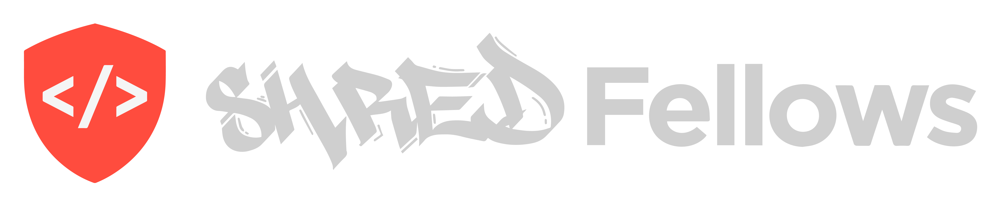

# 

**Live Site (be patient with Heroku):** [http://shredfellows.ccs.net/](http://shredfellows.ccs.net/)

## Project

This application is accessible through CanvasInstructure for CodeFellows students and as a guest for anyone with a GitHub account. Educational content and challenges are dynamically populated through a staff-maintained GitHub Repo. Students can watch tutorials, read instructive documentation, take notes, and practice new concepts in a persistent REPL (code editor). Assigned challenges can be submitted directly back to Canvas for instructional staff to track and grade.

### Technologies Used

ReactJS, ExpressJS, MongoDB, Webpack, various node modules.

### Test runner

* jest-enzyme

## Getting Started in Development

* Step 1. Fork and Clone the Repository.
* Step 2. `npm install` on both Service and Website
* Step 3. Run Mongo DB
* Step 4. `npm run watch` Services, `npm run start` Website
* Step 5. You should now be able to visit: `http://localhost:8080` to log in to the application
* Step 6. Login with your GitHub account
* Step 7. Choose a challenge from the menu and code away

## User Flow:

### &nbsp; Assignments for students:


```
  The "Pages" component checks for a GitHub token, if present it will open the assignment

  If there is no token, a GitHub login will be prompted 
```
### &nbsp; Assignments as a guest:

```
  Same "Pages" component determines if user is a guest by checking in the "assignment length" which in a guest case is 0.

  This prompts the GitHub login and displays the user's GitHub profile picture, and a sidebar menu with the assignments.
```

## Data Flow:

### Assignment components:

* README and Notes

```
  The "Readme" component fetches the README file from GitHub by URL
  Same component renders the click event to open a note. 
  Once the Note icon is clicked, the "Note" component handles change and submit events so the note is saved to the specific assignment
```
* Video

```
  The "Video" component renders it by URL
```

* Repl environment ("monaco-editor" module)
```
Multiple components handle this part.
  "Rotator" component displays the challenges, uses a doubly
  linked list (the children of the component) structure from a .js file outside of the component, sets state to the active child in the list

  "Workspace" component runs code in the coderunner, with the "nel" module, to check for errors.  
    Same component generates the assignment link an the copy link field for canvas users only.

  The "Repl" component provides the environment to run and check code with the "monaco-editor" module

```

## Authors

Ben Hurst, Justin Morris
